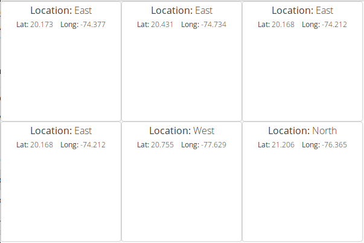
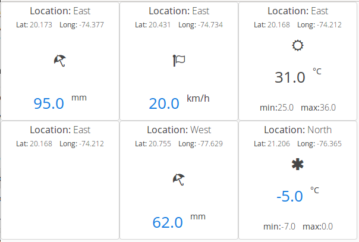

# Vaadin demo application using spring-boot and spring-plugin

This demo implements a "pluggable" [Vaadin](https://vaadin.com) application with [Spring Boot](https://projects.spring.io/spring-boot/) and [Spring Plugin](https://github.com/spring-projects/spring-plugin)

## Building the demo
```
git clone https://github.com/hectorlicea/vaadin-spring-plugin-demo.git
cd vaadin-spring-plugin-demo
mvn clean install
```

## Running the demo
```
java -jar main/target/main.jar
```
Start you browser with <http://localhost:8080>

All data show with default plugin.



### Add weather-plugin plugin

**1. Stop the application**

**2. Create plugins folder. For example in `/opt`**
```
mkdir /opt/plugins
```

**3. Copy `weather-plugin.jar` file to plugins folder.**
```
cp weather-plugin/target/weather-plugin.jar /opt/plugins
```

**4. Start `main` application with the plugins folder name in `loader.path` parameter with**
```
java -Dloader.path=/opt/plugins -jar main/target/main.jar
```
**5. Start you browser with <http://localhost:8080>**

weather data show with plugin 

